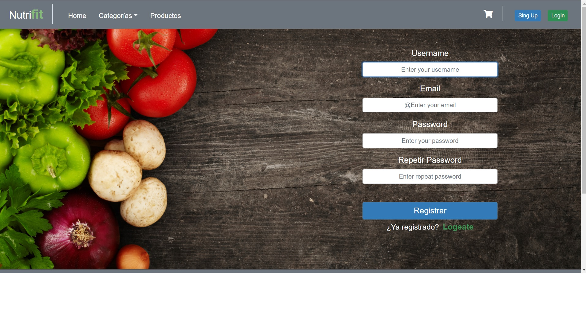
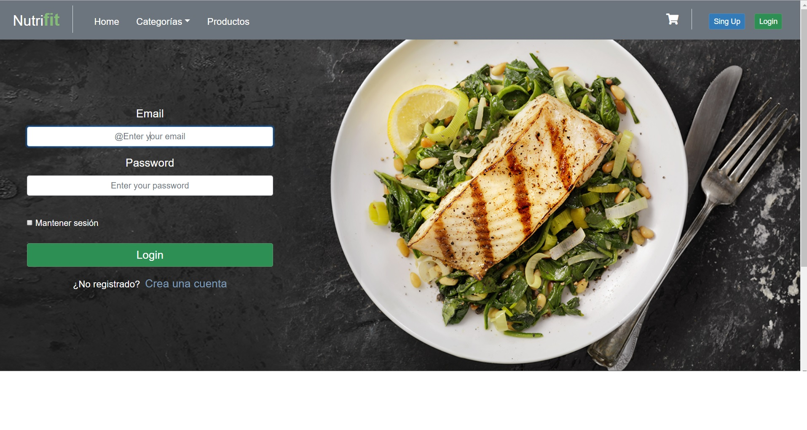
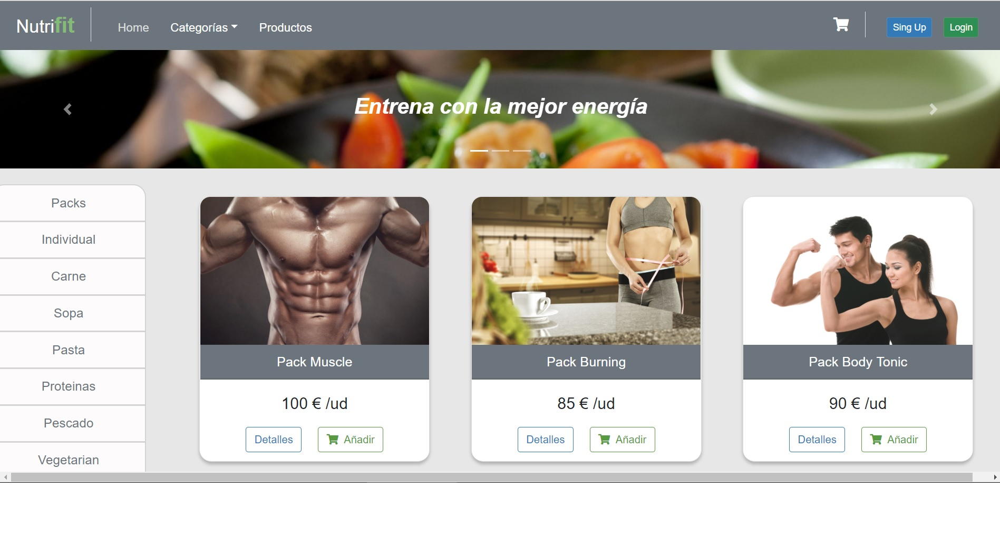
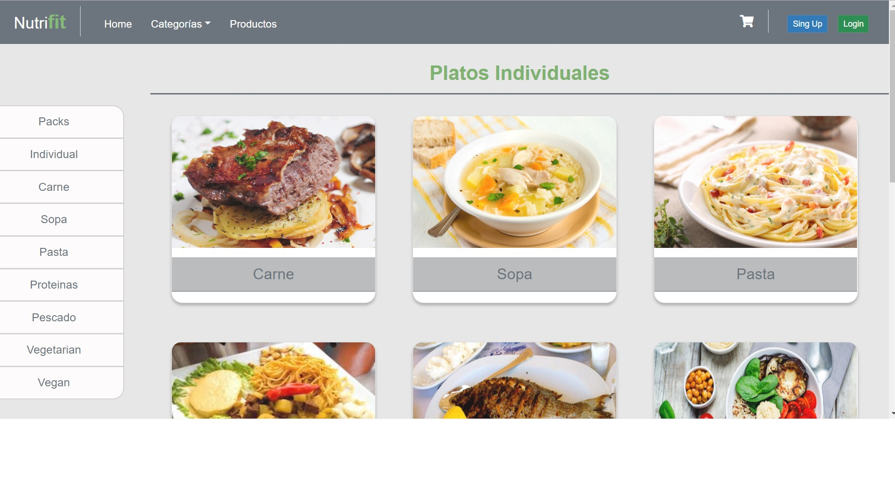
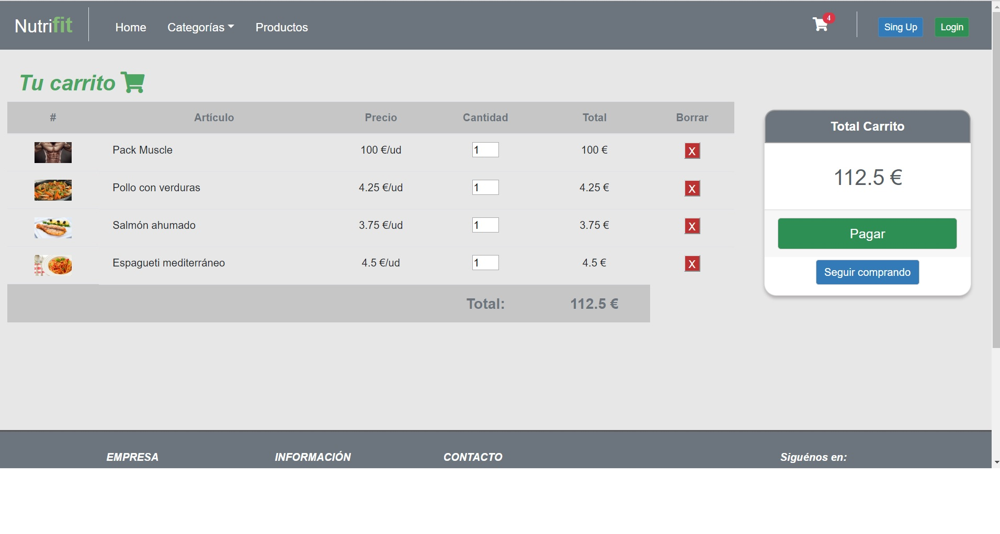
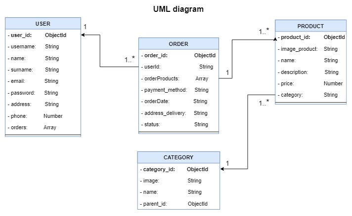
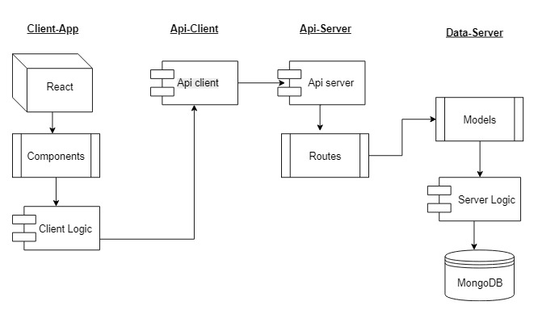

# NUTRI-FIT 💪

## TARGET

E-comerce web platform focused on the sale of nutritional food products. The sale of these products is aimed at people looking for a specific diet. For this, both individual dishes and specialized packages are available for a type of nutritional plan.

## FUNCTIONAL DESCRIPTION

### USE CASES

### SCREENSHOTS

###  * Register

### * Login

### * Home 

### * Individuals Category

### * Cart

### * Order

## TECHNICAL DESCRIPTION

### DATA MODEL

### BLOCK MODEL

### TECHNOLOGIES 

### - Client side
* Javascript
* HTML5
* CSS3
* Bootstrap
* React

### - Server side
* Node
* Express.js
* MongoDB
* Mongoose

### - Testing
* Mocha
* Chai
* NYC

## SHOW DEMO

Try a demo of the project here: [Link](https://nutri-fit.surge.sh)

## Information about this repository

To make the application work, you must create an .env file and configure the variables for the correct use of the API. Remember that you must also install the dependencies. The Front-End uses the API to communicate with the Back-Endr. Server is responsible for managing communication with the database.
